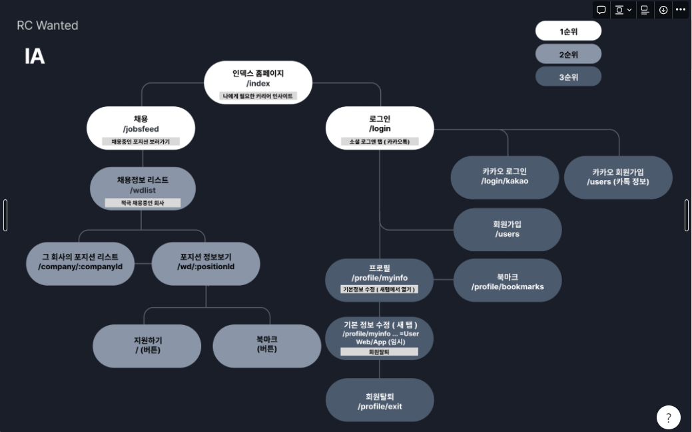

# Wanted 클론코딩 (2022. 11. 26. ~ 2022. 12. 09)

## # 프로젝트 소개

#### Rising Test - 실제 서비스 중인 WEB 사이트들 중 임의로 지정받고, 랜덤으로 매칭된 팀원들과 2주동안 기능들을 추려서 클론코딩하는 테스트에 응시하여 만든 프로젝트입니다.

#### 저희는 Wanted 웹 사이트를 클론코딩 하였습니다.

#### (결과에 따라 `불합격`, `수료`, `우수수료`) - 결과: 우수수료

  

## # [API명세서 링크](https://docs.google.com/spreadsheets/d/1yunKBwvCzu4WzdhxYjpCZhn2RyoL8Mx3/edit?usp=sharing&ouid=109797634360706451664&rtpof=true&sd=true)

#### 저는 Woody라는 이름을 사용하였고, 프론트엔드에서 사용한 api는 체크하였습니다.

  

## # 기술스택

    

## # 플로우 차트

  

  

## # 특징

### - `Presentational and Container Component Pattern`을 적용하여 렌더링 관련 로직과, 데이터 관련 로직을 분리하려 했습니다.

### - `768px, 992px, 1200px`로 나누어서 반응형 웹을 적용했습니다.

### - `className`으로 특정 HTMLElement를 개발자 도구에서 빠르게 식별하기위해 `styled-components`는 가변 스타일링에 사용하고 scss를 주로 사용했습니다.

### - 인증 방식은 jwt 토큰을 이용하여 회원가입/로그인 등을 처리하였고, 로그인 유지는 jwt 토큰을 localStorage에 저장하여 구현하였습니다.

  

## # 구현 기능

### 1. 랜딩 페이지(커리어 인사이트 조회) - `LandingPage/CareerInsight`

- `커리어 고민, 취업/이직, 리더십 등` 관심사에 따른 게시물들이 모여있는 페이지입니다.
- 반응형 carousel이 특징인 페이지입니다.   

  

      

### 2. 회원가입/로그인 페이지 - `AuthPage`

- 정규표현식을 이용한 이메일 및 비밀번호 검증을 적용하였습니다.

  
  

      

### 3. 유저정보 페이지 - `UserInfoPage`

- 개인신상 정보(프로필 이미지, 전화번호 등) 조회/수정이 가능한 페이지입니다.
- 회원 탈퇴 기능이 있습니다.

  

    

### 4. 북마크 페이지 - `BookMarkPage`

- 유저가 북마크한 채용 포지션이 저장되는 페이지입니다.
- 해당 페이지 내에서도 북마크 추가/취소가 가능합니다.
    

### 5. 추가 정보 페이지 - `AdditionalInfoPage`

- 대학 검색 기능 및 개인 정보가 대략적으로 표시되는 페이지입니다.
- 대학교 검색 기능: 검색어값의 변화에 따라 서버로 너무 잦은 request를 보내는 것을 방지하기 위하여 redux-saga의 주요 함수인 `debounce`를 사용하였습니다.
    

### 6. 채용 페이지 - `JobsFeedPage`

- 채용 중인 포지션을 테마별로 개괄적으로 보여주는 페이지입니다.
- 반응형 슬라이더를 넣어주었습니다.
    

### 7. 포지션 리스트 페이지 - `PositionListPage`

- 특정 회사의 채용중인 포지션 리스트를 확인 할 수 있습니다.
    

### 8. 포지션 상세 정보 페이지 - `PositionInfoPage`

- 채용중인 포지션에 대한 상세 정보가 담겨있는 페이지입니다.
- long text들은 서버에서 innerHtml 형태로 받아와서 스타일링만 넣어주었습니다.
    

### 9. 채용 정보 검색 페이지 - `WdListPage/SearchResultPage`

- 전체 직무와 해당 직무 내에서 상세 직군을 태그별로 클릭하여 검색할 수 있는 페이지입니다.

  

  

## 2022. 11. 26.

    1. module설치(axios, styled-compoents, react-router-dom, node-sass, react-responsive)
    2. 라우팅 경로 설정.
    3. Header, Nav 컴포넌트 구현(for common)

## 2022. 11. 27.

    1. module설치(Swiper)
    2. LandingPage
        - MainBanner(carousel)
        - 커리어 인사이트 섹션 slide

## 2022. 11.28

    1. LandingPage
        - 커리어 인사이트 섹션(content-card-section)
        - 커리어 인사이트 섹션 slide button 수정 (blue, white)
        - content-card-section button(for lazy-load) => server에서 할 것인지 front에서 할 것인지??
        (일단은 front에서 렌더링 제한)
        - 채용정보 섹션(recruitement)
    2. Footer(for common)
    3. JobFeedPage
        - dummy data

## 2022. 11. 29

    1. FourCardCarousel 구현
    2. header - menu padding 수정.
    3. LandingPage - category Slide => Swiper로 교체.
    4. MainBannerCarousel -> 반응형 텍스트 박스 추가.

## 2022. 11. 30

    1. TwoCardCarousel 구현
    2. 리팩토링 - TwoCardCarousel, FourCardCarousel - data 분리.
    3. authForm - login 아이디 입력 창, password 입력 창,

## 2022. 12. 01

    1. WdListPage
        - tagSlider 구현 반응형
        - tagData 입력

## 2022. 12. 02

    1. WdListPage
        - SearchResultPage 추가
        - tagSlider 스크롤 내려갈 시, position: fixed;
        - :jobgroupId, :jobId 데이터 생성(JSON)
            - Navigation 생성
        - activeCompanySection(적극 채용 중인 회사) 추가
    2. ProfilePage
        - BookMarkPage Setting.
    3. LandingPage
        - CareerInsightSection을 하위 페이지로 분리 => CareerInsightPage
    4. PositionListPage setting.

## 2022. 12. 03

    1. WdListPage
        - SearchResultPage 데이터 추가
        - FourCardData - React.memo추가 북마크 버튼 눌리지 않는 이상 리렌더링 방지.
        - activeCompanyData.json 수정(tag추가)
    2. PositionListPage
        - 태그리스트 추가
        - positionList 추가

## 2022. 12. 04

    1. PositionListPage
        - CompanyDetail 리팩토링
        - 페이지 완성
    2. PositionInfoPage
        - KakaoMap 연동
        - 페이지 완성

## 2022. 12. 05

    1. Redux setting(Redux, Redux-saga, redux-devtools-extention, redux-action)
    2. Reducer(loading)
    3. axios CLIENT => baseURL setting
    4. wdListPage
        - jobGroup navigation 추가
    5. LoadingSpinner 추가
    6. LandingPage - matchedJobSection 서버 연동
    7. activeCompany(적극 채용 중인 회사) 서버 연동

## 2022. 12. 06

    1. Register Page
    2. 로그인 기능
    3. localStorage에 유저 정보 저장을 통해 유지

## 2022. 12. 07

    1. 북마크 추가/삭제
    2. PositionInfo 서버 연동(포지션 상세보기 7번)
    3. user정보 수정 페이지
    4. bookMarkListPage

## 2022. 12. 08

    1. 회원가입
    2. 학교 검색

## 2022. 12. 09

    1. 회원탈퇴
