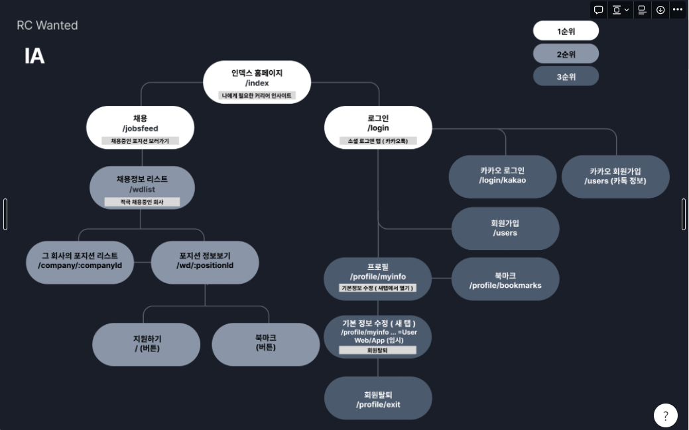

# Wanted 클론코딩

## 목표
Rising Test - 실제 서비스 중인 WEB 사이트들 중 임의로 지정받고, 랜덤으로 매칭된 팀원들과 2주동안 기능들을 추려서 클론코딩하는 테스트 응시.
(결과에 따라 `불합격`, `수료`, `우수수료`)

  

## 플로우 차트
  

## API 명세서(본인 우디: 연동한 API는 check)
[API명세서] (https://docs.google.com/spreadsheets/d/1yunKBwvCzu4WzdhxYjpCZhn2RyoL8Mx3/edit?usp=sharing&ouid=109797634360706451664&rtpof=true&sd=true)

  

## 구현 기능
1. 회원가입/로그인(카카오 로그인 X)
2. 회원탈퇴
3. 회원정보수정
4. 학교검색
5. 채용정보검색(회사정보, 포지션정보)
6. 이벤트검색
7. 북마크 추가/취소

  

## 기술스택
- 프론트엔드: react, redux, redux-saga, axios, styled-components, scss

  

## 2022. 11. 26.
    1. module설치(axios, styled-compoents, react-router-dom, node-sass, react-responsive)
    2. 라우팅 경로 설정.
    3. Header, Nav 컴포넌트 구현(for common)

## 2022. 11. 27.
    1. module설치(Swiper)
    2. LandingPage
        - MainBanner(carousel)
        - 커리어 인사이트 섹션 slide

## 2022. 11.28
    1. LandingPage
        - 커리어 인사이트 섹션(content-card-section)
        - 커리어 인사이트 섹션 slide button 수정 (blue, white)
        - content-card-section button(for lazy-load) => server에서 할 것인지 front에서 할 것인지??
        (일단은 front에서 렌더링 제한)
        - 채용정보 섹션(recruitement)
    2. Footer(for common)
    3. JobFeedPage
        - dummy data

## 2022. 11. 29
    1. FourCardCarousel 구현
    2. header - menu padding 수정.
    3. LandingPage - category Slide => Swiper로 교체.
    4. MainBannerCarousel -> 반응형 텍스트 박스 추가.

## 2022. 11. 30
    1. TwoCardCarousel 구현
    2. 리팩토링 - TwoCardCarousel, FourCardCarousel - data 분리.
    3. authForm - login 아이디 입력 창, password 입력 창,

## 2022. 12. 01
    1. WdListPage 
        - tagSlider 구현 반응형
        - tagData 입력

## 2022. 12. 02
    1. WdListPage
        - SearchResultPage 추가
        - tagSlider 스크롤 내려갈 시, position: fixed;
        - :jobgroupId, :jobId 데이터 생성(JSON)
            - Navigation 생성
        - activeCompanySection(적극 채용 중인 회사) 추가
    2. ProfilePage
        - BookMarkPage Setting.
    3. LandingPage
        - CareerInsightSection을 하위 페이지로 분리 => CareerInsightPage
    4. PositionListPage setting.

## 2022. 12. 03
    1. WdListPage
        - SearchResultPage 데이터 추가
        - FourCardData - React.memo추가 북마크 버튼 눌리지 않는 이상 리렌더링 방지.
        - activeCompanyData.json 수정(tag추가)
    2. PositionListPage
        - 태그리스트 추가
        - positionList 추가

## 2022. 12. 04
    1. PositionListPage
        - CompanyDetail 리팩토링
        - 페이지 완성
    2. PositionInfoPage
        - KakaoMap 연동
        - 페이지 완성

## 2022. 12. 05
    1. Redux setting(Redux, Redux-saga, redux-devtools-extention, redux-action)
    2. Reducer(loading)
    3. axios CLIENT => baseURL setting
    4. wdListPage
        - jobGroup navigation 추가
    5. LoadingSpinner 추가
    6. LandingPage - matchedJobSection 서버 연동
    7. activeCompany(적극 채용 중인 회사) 서버 연동

## 2022. 12. 06
    1. Register Page
    2. 로그인 기능
    3. localStorage에 유저 정보 저장을 통해 유지
    
## 2022. 12. 07
    1. 북마크 추가/삭제
    2. PositionInfo 서버 연동(포지션 상세보기 7번)
    3. user정보 수정 페이지
    4. bookMarkListPage

## 2022. 12. 08
    1. 회원가입
    2. 학교 검색 

## 2022. 12. 09
    1. 회원탈퇴
